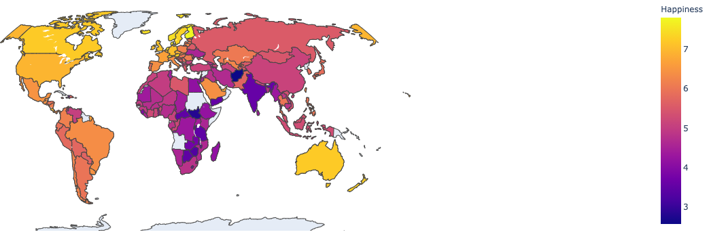

<!DOCTYPE html>
<html lang="en">

   <body>
      <!-- Add your content of header -->
      <header>
         <nav class="navbar  navbar-fixed-top navbar-default">
            

               

                  <ul class="nav navbar-nav navbar-right">
                     <li><a href="./index.html" title="" class="active">Home</a></li>
                     <li><a href="./World Happiness.html" title=""> World Happiness </a></li>
                     <li><a href="./contact.html" title="">London Happiness</a></li>
                     <li><a href="./components.html" title="">About us</a></li>
                  </ul>
               

            

         </nav>
      </header>
      

         

         

            

               

                  <h1>Visualize Happiness and its Influencing Factors</h1>
               

            

         

      

      

         

            

               <h2>  Take Happiness Seriously</h2>
               
"Happiness can change, and does change, according to the quality of the society in which people live." In this project, we want to explore and visualize how happiness is affected by different factors and how it varies from time to time and from place to place. 
               

            

            
            <h1> </h1>
            

               

                  

                     

                        

                           

                              <h2>Project Overview</h2>
                              

                                 

                                    <h3>World Happiness</h3>
                                 

                                 

                                    
This section presents the World Happiness rankings and takes a deeper look at how social, urban and natural environments together affect happiness.   

                                 

                              

                              

                                 

                                    <h3><London Happiness</h3>
                                 

                                 

                                    
In this section, we want to use a specific city: London as an example to show how the city's happiness changes over time and how other factors affect it.
                                    

                                 

                              

                           

                        

                     

                  

               

               <h2>  Visualization Tools  </h2>
            

         

         

            

               

                  <ul class="features">
                     <li>
                        <h4>Python</h4>
                        
Python offers multiple visualization libraries with different features. We used Matplotlib, Pandas visualization, Seaborn, and Plotly.These variable tools gave the flexibility to visualize complex data relations.
                        

                     </li>
                     <li>
                        <h4>Tableau</h4>
                        
This was the main tool we used in this project. Tableau helps to perform tasks such as sorting, comparing, and analyzing more effectively. Using Tableau data visualization allows us to make better, more data-driven decisions.
                        

                     </li>
                     <li>
                        <h4>Excel</h4>
                        
Using excel, we can quickly extract, merge, and split desired data. We can also remove unnecessary columns and change the data framework index to avoid inaccurate conclusions for better visual results.
                        

                     </li>
                     <li>
                        <h4>Web development toolkits</h4>
                        
To present the visualization result, we used web development toolkits such as HTML, Javascript, CSS. HTML helps structure the web content, and Javascript helps add more interactive features to the website. 
                        

                     </li>
                  </ul>
               

            

            <h3 style="text-align:center">  Go to Our Full Project Report for More Information </h3>
            

               <a href="https://drive.google.com/file/d/1JfCFlKjmwhzHFtGp71sG6_60GfhqUABh/view?usp=sharing" class="btn btn-primary btn-lg">View Full Report</a>
            

   
   </body>
</html>
